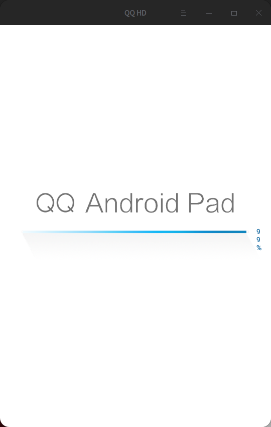
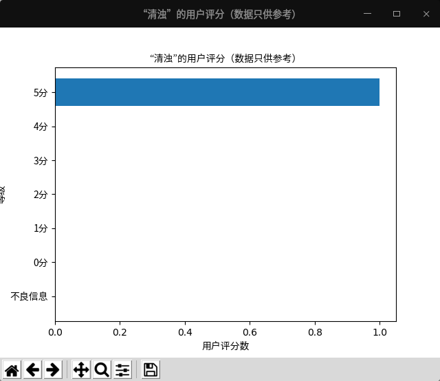
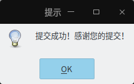
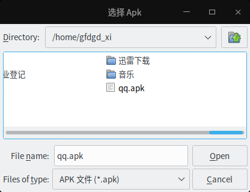
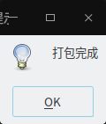
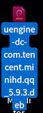
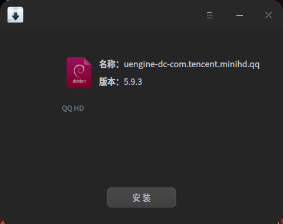

# UEngine 运行器帮助
---
## 帮助简述
> 安装APK：点浏览按钮，选中需要安装的APK，然后点安装按钮  
> 卸载APK：在卸载APK下面的输入框内输入需要卸载的APK包名，点卸载按钮，如果无法获取包名，可以通过浏览APK文件程序自动获取包名进行卸载。  
> 保存APK图标：在安装APK下面的输入框浏览或输入APK的路径，然后点击“保存图标”按钮，选择保存位置即可  
> 重置（删除）UEngine数据：点击菜单栏的“UEngine”的“清空UEngine数据”，输入密码重启即可  
> 注意：如果任何安卓一遍打不开，多打开几遍应该就可以重新加载UEngine配置了  
> 打开UEngine应用列表：打开系统已安装的应用列表（安卓界面）  
> **提示：**   
> **※1、近期升级的 UEngine 安装时会自动把要安装的 apk 删除，如果这个 apk 文件非常重要请拷贝一个备份版并安装这个备份版**   
> **2、需要你有使用 root 权限的能力；**  
> **3、需要安装 UEngine 才能使用；**  
> **4、提取 apk 图标的 apk 路径以“安装 apk”那栏为准;**  
> **5、如果想要使用adb连接UEngine或其他手机，请使用 1.2.0 以前的版本。（如需连接UEngine请安装adb补丁）**  

---
## 详细帮助
### 如何安装自己的 Apk
*请保证您已经把要安装的Apk下载到电脑本地并保证Apk完整且有权限*
#### 方法一
1. 打开 UEngine 运行器   
  
2. 点击浏览按钮，找到想要安装的Apk  
  
3. 点击安装按钮，输入密码
  
4. 提示“操作完成”，在启动器找到新安装的图标启动即可  
  
  
#### 方法二
1. 打开要安装的Apk所在目录，右击=>打开方式=>安装或卸载 APK（UEngine 运行器）  
  
2. 点击安装按钮，输入密码  
  
3. 提示“操作完成”，在启动器找到新安装的图标启动即可  
  
  

### 卸载Apk
#### 方法一
1. 打开 UEngine 运行器   
  
2. 点击浏览按钮，找到想要卸载的Apk  
  
3. 点击卸载按钮，输入密码  
  
4. 提示“操作完成”，卸载完成    
  
#### 方法二
1. 打开要安装的Apk所在目录，右击=>打开方式=>安装或卸载 APK（UEngine 运行器）  
  
2. 点击卸载按钮，输入密码  
  
3. 提示“操作完成”，卸载完成  
  

### 查询Apk信息
1. 打开 UEngine 运行器   
   

2. 点击“Apk 信息” 按钮即可查询Apk信息

  

### 查看程序评分
1. 打开 UEngine 运行器   
   

2. 点击“Apk 信息” 按钮即可查询Apk信息
  

3. 点击“查看程序评分情况”即可查看其他用户对程序的评分

  

### 上传用户评分

1. 打开 UEngine 运行器   

   

2. 点击“Apk 信息” 按钮即可查询Apk信息

  

3. 点击“上传程序评分情况”，按照要求进行评分

  

4. 如果提示“提交成功！感谢您的提交”就代表评分成功

  

### 更新程序

1. 打开 UEngine 运行器   

  

2. 点击“关于”=>“检查更新”，打开更新窗口

  

3. **保证您的电脑没有运行其它Python应用以及本程序所有工作都已经完成**，再点击“更新（更新过程中会关闭所有Python应用，包括这个应用）”，输入密码以进行更新

  

4. 提示“更新完毕！”后重新启动 UEngine 运行器就更新完毕了

  

### 保存图标

1. 打开 UEngine 运行器   

  

2. 选择要保存图标的Apk，点击“保存图标”按钮，选择要保存的位置即可

  

### 打开已安装的程序列表

#### 方法一

打开启动器=>UEngine 程序菜单 即可

#### 方法二

1. 打开 UEngine 运行器   
  

2. 点击“打开 UEngine 应用列表”即可

  

### 将 Apk 打包成可以无需本应用即可安装的 deb 包

#### 打开 UEngine 打包器的三种方法

##### 方法一

启动器=>UEngine 应用打包器

##### 方法二

打开要打包的 Apk 所在目录，右击=>“打开方式”=>“打包 deb（UEngine 运行器）”（接下来可以略过步骤一）

##### 方式三

打开 UEngine 运行器，点击菜单栏的“UEngine”=>“UEngine 应用打包”

#### 打包 deb

1. 打开“UEngine Apk 应用打包器”，点击“浏览按钮”选择apk

  

2. 根据实际情况勾选选项，然后点击“打包”进行打包

  

3. 当提示“打包完成”时，打包完成，可以在桌面（一般是`/home/XXX/Desktop`）找到您打包的 deb 包，可以双击安装

  

  

  

           

        

        

     

     

     

  

  

  ©2021-2022